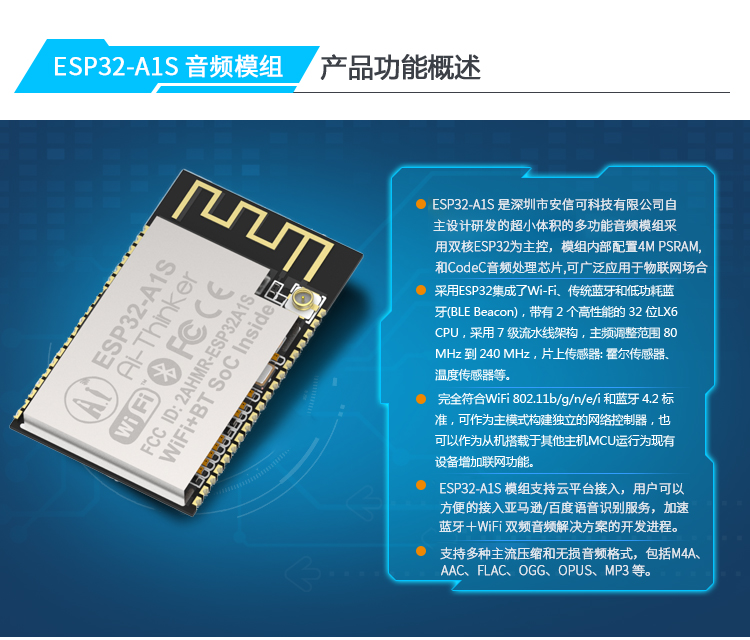
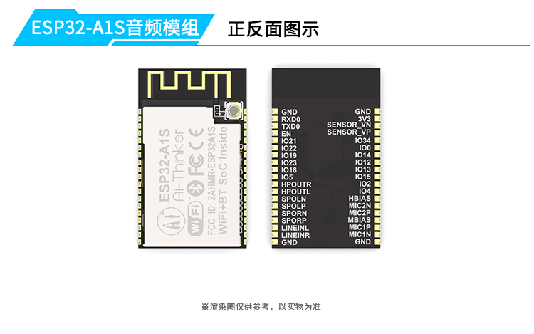
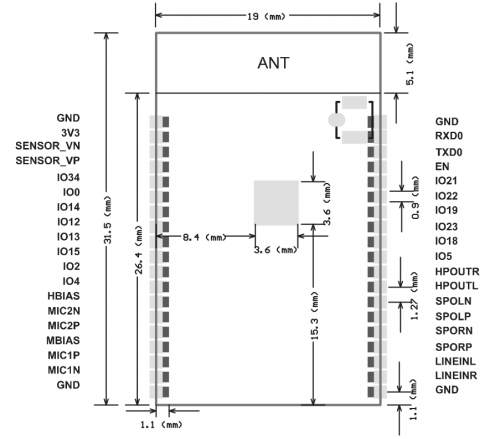
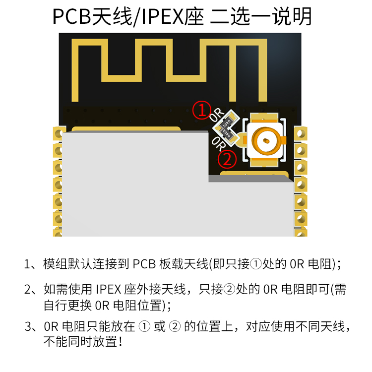
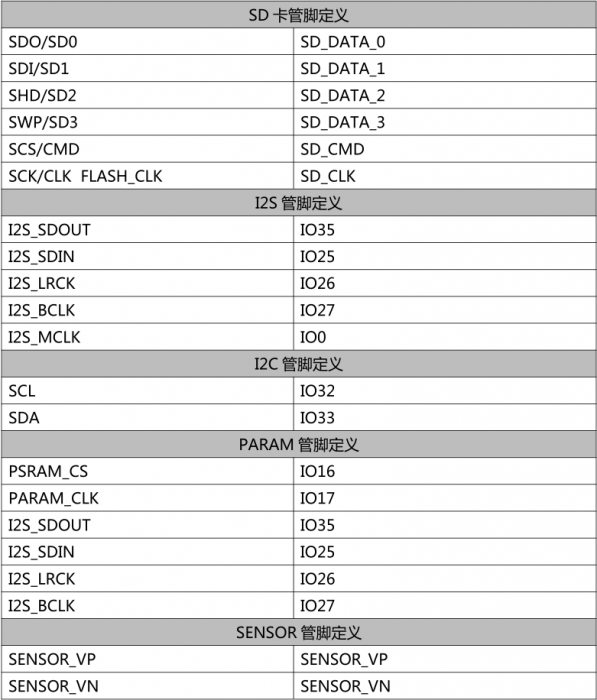
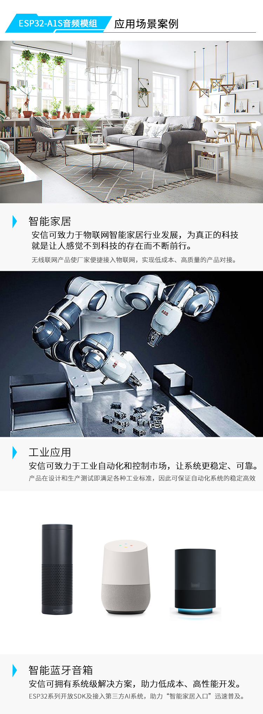

### 产品介绍

[帮助文档](https://docs.ai-thinker.com/esp32-a1s)
[GitHub](https://github.com/donny681/esp-adf.git)
[规格书](./esp32-a1s_product_specification_zh.pdf)
[环境配置](http://wiki.ai-thinker.com/esp32-a1s/env))
[音频产品硬件设计指南](./esp32_audio_design_guide.pdf))
[硬件封装](./esp32-a1s_module.rar)
[出厂固件](https://docs.ai-thinker.com/_media/esp32/boards/a1s_factory_firmware.zip)

* Q: ESP32-S,ESP32-WROOM-32,ESP32-A1S这三款模组有什么区别？
A: ESP32-S与ESP32-WROOM-32为通用类型的模组，软硬件部分，除了天线形式有差异，其他都一样，ESP32-A1S模组内置`AC101`音频解码芯片，可以进行音频相关的开发，支持播放音乐和录音

* Q: ESP32-A1S和ESP32-Audio-kit的区别是什么？
A: ESP32-Audio-kit是ESP32-A1S的开发板，包含ESP32-A1S模块

* Q: ESP32-A1S模组需要使用外接天线的时候要怎么做?
A: 需要将连接到板载天线的0欧姆电阻移位到连接天线座子的电阻位置上

* Q: ESP32-A1S编程和ESP8266的一样吗？ 
A: 都是使用C语言，但是程序架构不一样

* Q: ESP32-A1S支持与STM32的SPI通讯吗？
A: 支持哦的，不过需要二次开发

* Q: ESP32-A1S 模组主要应用哪个领域，内置音频解码芯片是哪一个型号，出厂默认固件是哪一个，支不支持二次开发？
A: 主要应用于家庭智能设备、车载智能设备、智能音箱等方案，内置音频解码芯片为AC101，出厂默认烧录测试固件，工作状态分为两种模式：TF卡模式和蓝牙模式，两种模式通过按键进行切换，当没有插入TF卡时只能切入到蓝牙模式，当插入TF卡后可以使用两种任一模式，TF卡检测只在程序启动时进行，当程序启动后不在检测TF卡插入。不支持 AT指令，如果需要其他功能请参考我们的ai-example例子进行固件二次开发

#### 产品特性

* 主芯片采用低功耗双核32位CPU，主频高达240MHz，运算能力高达600DMIPS
* 内置CodeC音频解码芯片,支持本地播放音乐和录音
* 支持两路MIC输入和Linein方式输入
* 支持耳机和扬声器输出
* 内置 520KB SRAM+ 8M PSRAM，默认32Mbit SPI Flash
* 支持SoftAP和Station模式
* 体积超小的802.11b/g/n Wi-Fi + BT/BLE SoC模块
* 支持UART/SPI/I2C/I2S/PWM/ADC/DAC等
* 支持固件升级（FOTA）
* 天线支持板载天线或者IPEX座输出
* 支持多种主流压缩和无损音频格式，包括 M4A、AAC、FLAC、OGG、OPUS、MP3、WAV等

#### 产品功能

#### a1s-产品图

#### a1s-天线

#### a1s-gpio

#### a1s产品应用

家庭智能设备
车载智能设备
工业智能设备
智能音箱
故事机方案

#### 淘宝购买地址

[click](https://item.taobao.com/item.htm?spm=a1z10.5-c-s.w4002-16491566042.26.5c547cd7YwoTcl&id=574509789383)