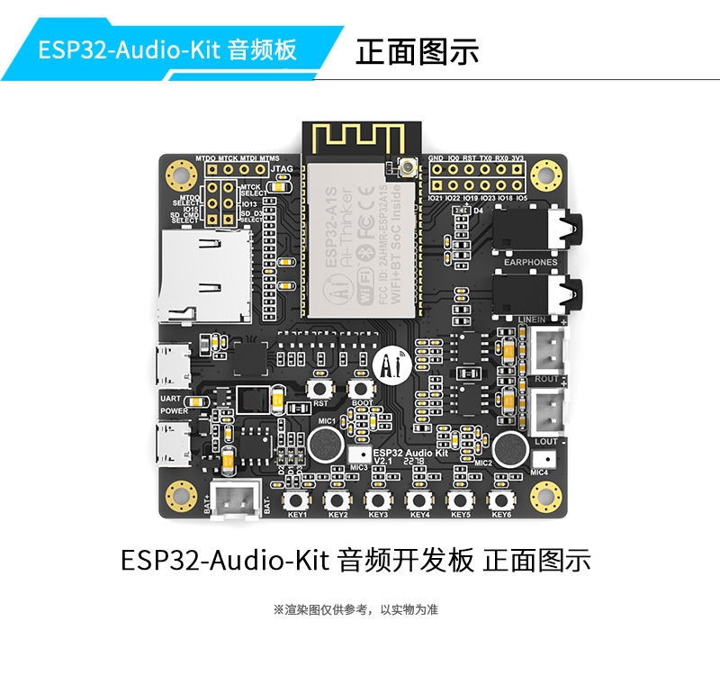
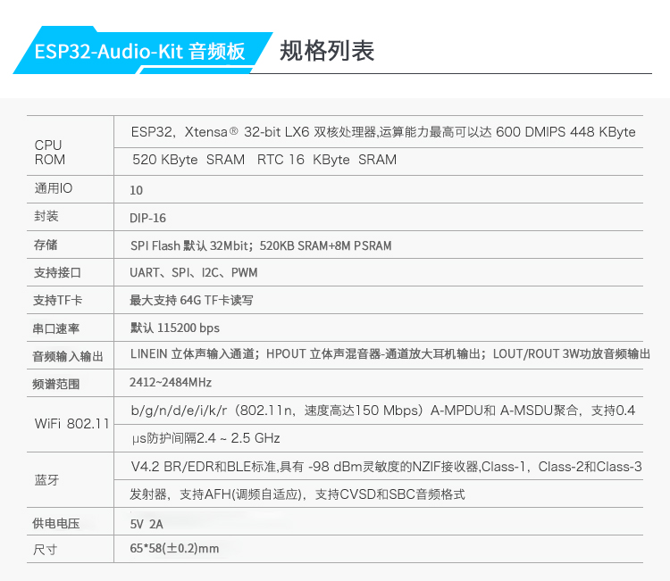
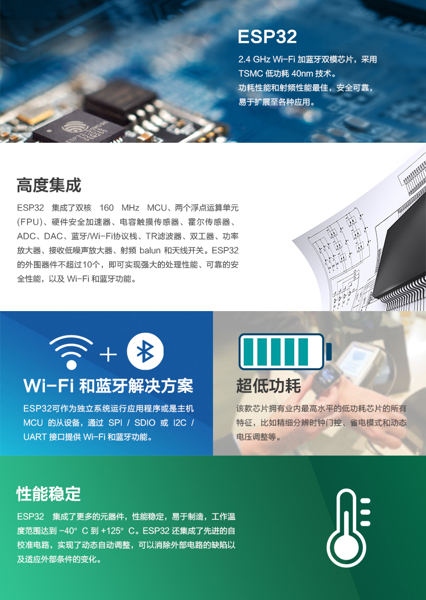
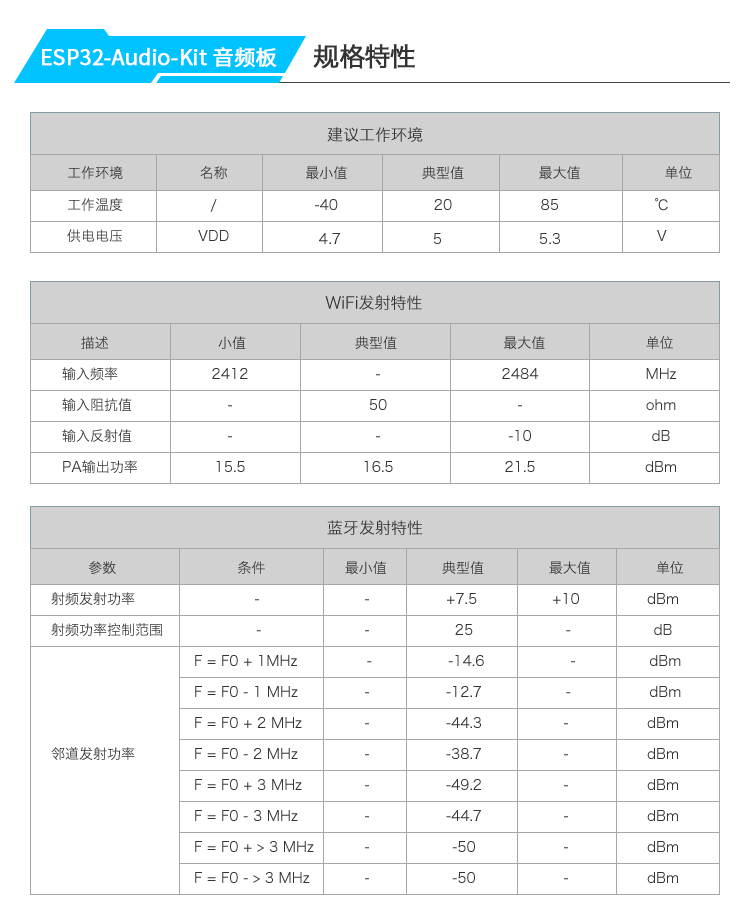
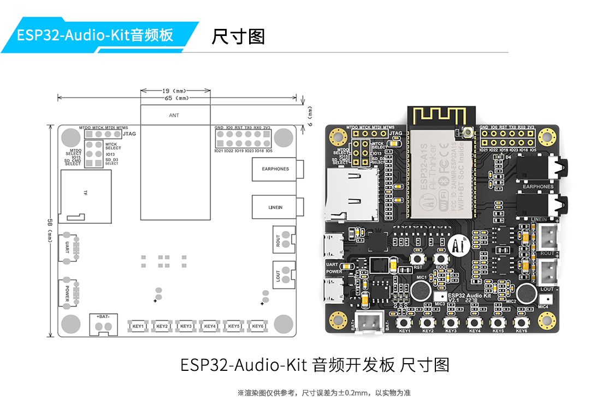
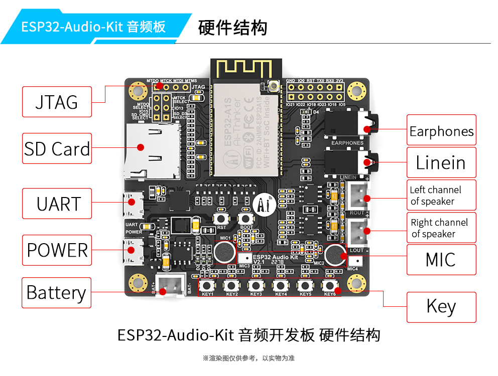

### 产品介绍

* 采用低功耗双核32位CPU，可作应用处理器
* 主频高达240MHz，运算能力高达 600 DMIPS
* 内置 520 KB SRAM，8M PSRAM
* 支持UART/SPI/I2C/PWM等接口
* 耳机口：插入3.5mm耳机插口，支持左右声道输出
* 左右声道扬声器：支持输出4Ω 3W喇叭输出，同时支持双声道输出
* 两路模拟麦克风，分别作为音频输入；支持耳机麦克风输入
* 支持3.7V 锂电池输入；支持 5V 2A电源输入，支持同时锂电池充电
* 支持64G SD卡读写
* 支持多种休眠模式
* 内嵌Lwip和FreeRTOS
* 支持 STA/AP/STA+AP 工作模式
* 支持 Smart Config/AirKiss 一键配网

#### 开发板

#### 产品规格

#### 高度继承 

#### 开发板参数

#### 开发板尺寸 

#### 开发板模块说明

#### 淘宝购买地址

[click](https://item.taobao.com/item.htm?spm=a1z10.5-c-s.w4002-16491566042.16.4d938114TPityh&id=578317054056)

#### 产品指南

本用户指南介绍了如何开始使用ESP32-Audio-kit开发板。

#### 你需要什么

1个 ESP32-Audio-kit开发板
1个 micro USB线
1个PC装有Windows,Linux或者Mac OS系统

#### 概述
ESP32-Audio-kit是Ai-Thinker基于ESP32-A1S模组开发的小型音频开发板,大多数音频外设分布在开发板两侧，支持TF卡，耳机输出，两路麦克风输入和两路喇叭输出。方便开发人员迅速开发。

#### 功能描述
下面列表描述esp32-audio-kit关键组件，接口

#### 耳机口（earphone）
插入3.5mm耳机插口，支持左右声道输出。

#### 左右声道扬声器（left channel of speaker/right channel of speaker）
支持最大输出4Ω3W喇叭输出，同时支持双声道输出。

#### SD卡
最大支持64G SD卡读写

#### 按键（KEY）
支持6路按键输入，默认出厂以下接入方式

| key | IO |
| --- | -- |
| NAME | IO |
| KEY1 | IO36 |
| KEY2 | IO13 |
| KEY3 | IO19 |
| KEY4 | IO23 |
| KEY5 | IO18 |
| KEY6 | IO5 |

可以修改电路按键AD输入。

#### 麦克风
两路模拟麦克风，分别作为音频输入

#### 耳麦输入(LINEIN)
支持耳机麦克风输入

#### 锂电池（battery）
支持3.7伏锂电池输入

#### 电源输入（POWER）
最大支持5V2A电源输入，支持同时锂电池充电。

#### 串口（UART）
支持micro usb串口输入输出，最大支持921600波特率

#### 下载按钮（BOOT）
下载时请拉低。由于IO0提供codec时钟，程序正常运行时请勿按下，否则影响codec工作

（出厂已含有默认固件，如果需要烧录默认固件你可以点击页面底部的压缩包进行下载）

#### 复位按钮（EN）
按此按钮可以重置系统

#### 供电方式
1.Micro USB端口 5V/2A
2.锂电池供电
资料下载件

#### SDK下载

[SDK例子](https://github.com/donny681/esp-adf)

#### ESP-ADF API文档

[ESP-ADF文档](https://docs.espressif.com/projects/esp-adf/en/latest/get-started/index.html#about-esp-adf)

#### 原理图下载

[原理图下载](esp32-audio-kit_v2.2_sch.pdf)

#### 例子

具体使用教程请参开ESP-ADF里面Ai-example例子

#### 出厂固件使用说明

出厂固件说明

##### 概述

    ESP32-Audio-Kit出厂默认烧录测试固件，工作状态分为两种模式：TF卡模式和蓝牙模式，两种模式通过按键进行切换，当没有插入TF卡时只能切入到蓝牙模式，当插入TF卡后可以使用两种任一模式，TF卡检测只在程序启动时进行，当程序启动后不在检测TF卡插入。

##### 前期准备

    1X ESP32-Auido-Kit开发板
    两条MicroUSB线
    1张TF卡（容量不超过64G）
    一副耳机
    两个4Ω3W扬声器

##### 操作流程

    在TF卡根文件夹下建立music文件夹，将MP3格式的音乐文件放到music文件夹下。
    插入TF卡，然后插入耳机或接入扬声器。
    插入跳线帽连接IO15和SD_CMD_SELECT以及IO13和SD_D3_SELECT。
    连接完毕后插入电源和串口，将串口波特率设置到115200并打开电脑串口，可以看到模块启动日志。
    按下KEY2键切换到SD卡模式，按下按键后大概5S左右进入SD卡模式，并播放SD卡下的音乐，然后可以通过按键控制音乐播放，具体按键对应的功能见附录表格。可以尝试控制播放音量，暂停和切歌等功能。
    再次按下KEY2键进入蓝牙模式，然后使用手机连接上模块蓝牙,默认名称为“BT-SD-Player”，连接上蓝牙后打开手机音乐播放器播放音乐，同样可以通过按键控制音乐播放。
    注意：没有SD卡的情况下默认启动后进入蓝牙模式，可通过手机连接蓝牙（SD-BT-Player）进行播放音乐，通过按键控制音乐播放，按键对应功能见邮件尾部功能引脚。

##### 按键功能说明

| 按键名称|功能名称|功能|备注|
|  ----  | ----  | --- | -- |
| KEY1|PREV| 上一首 ||
| KEY2|MODE| 切换蓝牙和SD模式||
| KEY3|NEXT| 下一首||
| KEY4|STOP/PLAY|播放暂停||
| KEY5|VOL+|音量加|最大音量60||
| KEY6|VOL-|音量减||

（出厂已含有默认固件，如果需要默认固件你可以点击以下压缩包进行下载）

##### 出厂固件

* [出厂固件.zip](factroy_bin.zip)
* [源站下载](http://wiki.ai-thinker.com/_media/esp32/boards/%E5%87%BA%E5%8E%82%E5%9B%BA%E4%BB%B6.zip)

